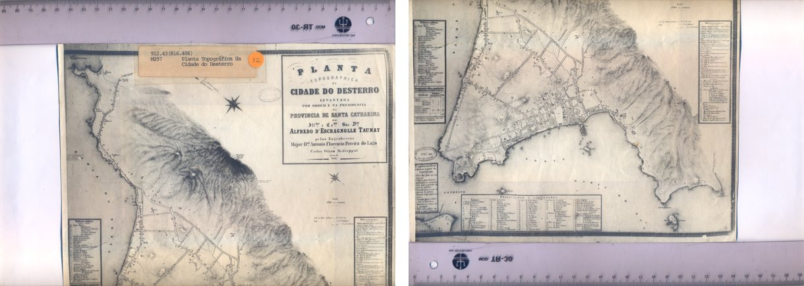
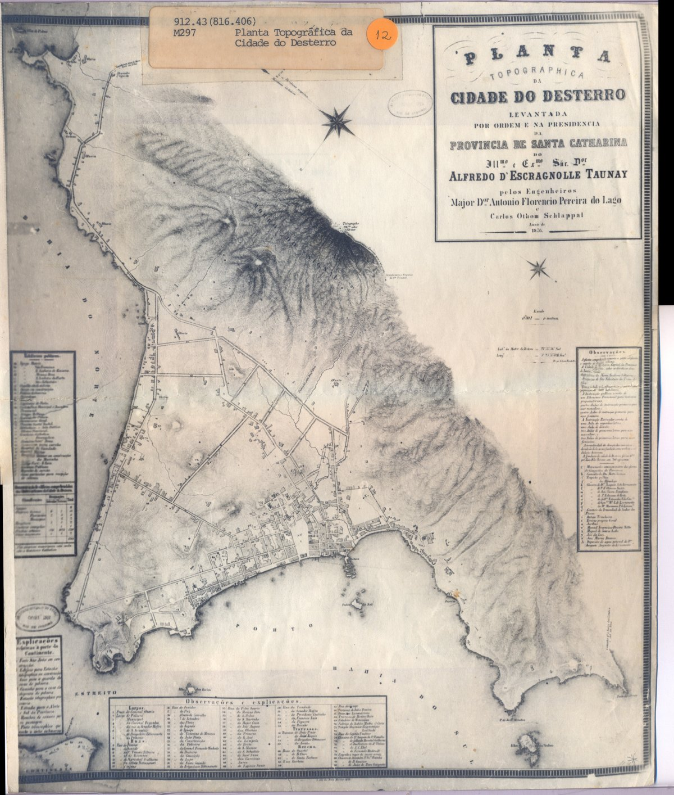
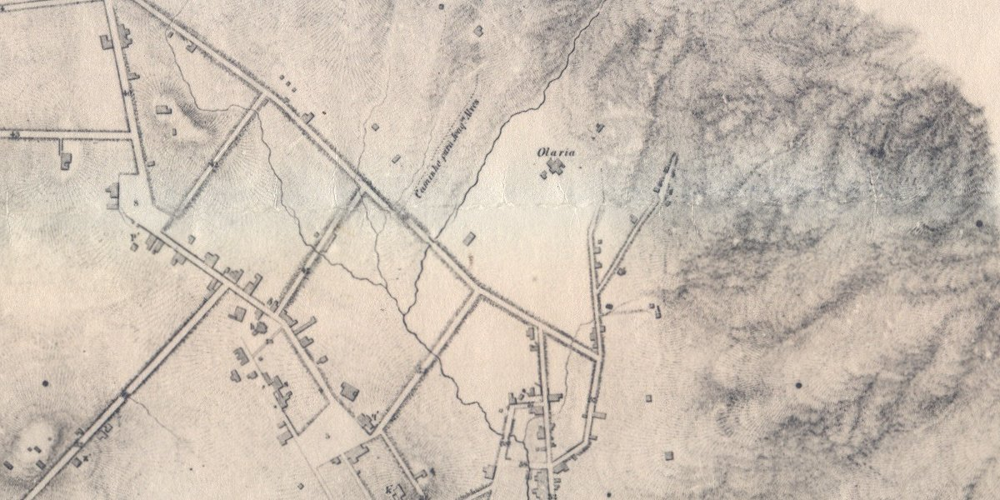

# desterro-1876

Stitching, and independently verifying, the two library scans of the
**Planta topographica da Cidade do Desterro** (1876), the earliest detailed
topographic survey of Florianópolis, Santa Catarina, Brazil.

The sheet is larger than an A4 flatbed, so the Federal University of Santa
Catarina (UFSC) library digitised it as two overlapping scans. This project
recovers the geometry between the two scans from image content alone, blends
them into one 3020 × 3560 px image at 300 dpi, and then checks the result
against a *different* copy of the same map, digitised separately by the
Biblioteca Nacional in Rio de Janeiro.

| Inputs (UFSC, two A4 scans) | Output (stitched and trimmed) |
|---|---|
|  |  |

## Why this exists

Historical sheets in Brazilian archives are routinely published in pieces:
too big for the scanner, so two or four files per document. Anyone who wants
to *use* the map (georeference it, crop a neighbourhood, compare it with a
modern map) first has to put it back together, and has to be able to say how
well that was done.

The same pipeline answers a question that comes up in AI evaluation work:
*given a fragment of a real-world image, can the whole be identified and
reconstructed, and how do you prove the reconstruction is right?*

## Method

`src/desterro/stitch.py`:

1. **Features.** SIFT keypoints on both scans, down-sampled 4× for speed.
2. **Matching.** FLANN k-nearest-neighbour matching with Lowe's ratio test
   (0.75).
3. **Model.** A *partial affine* transform (rotation, uniform scale,
   translation; 4 degrees of freedom) estimated with RANSAC. A flat sheet on
   a flatbed cannot produce perspective, so a full homography would only add
   ways to overfit.
4. **Blending.** The lower scan is warped into the upper scan's frame and the
   two are joined along a **narrow seam** (80 px transition on the line
   equidistant from both scan borders). A wide feather was tried first and
   rejected: the folded paper is not perfectly rigid, the residual error is a
   few pixels, and blending the whole overlap drew every street twice.
5. **Report.** Every run writes `output/stitch-report.json` with match and
   inlier counts, RMS reprojection error and the recovered transform.

`src/desterro/verify.py` runs the same feature pipeline between the stitched
image and the Biblioteca Nacional scan. If the stitch were wrong, the two
would not be related by a single similarity transform across the whole sheet.

## Results

Stitch (UFSC lower scan → UFSC upper scan):

| metric | value |
|---|---|
| good matches after ratio test | 480 |
| RANSAC inliers | 297 |
| RMS reprojection error | 6.3 px (0.53 mm at 300 dpi) |
| rotation between the two scans | −0.52° |
| relative scale | 0.9998 |

Verification (stitched image → Biblioteca Nacional scan, independent copy):

| metric | value |
|---|---|
| good matches | 281 |
| RANSAC inliers | 132 |
| RMS error | 7.0 px |
| rotation | +0.11° |
| relative scale | 1.355 (the BN scan is at a lower resolution) |

The inlier set spans the whole sheet, including the overlap zone, so the two
halves were placed consistently with an unrelated digitisation of the same
document. Seam close-up at 1:1, right across the join:



Reports: [`output/stitch-report.json`](output/stitch-report.json),
[`output/verify-report.json`](output/verify-report.json).

## Provenance and licensing

Every image in this repository is documented in [`PROVENANCE.md`](PROVENANCE.md):
holding institution, catalogue record, identifier, file names as published,
download date and rights basis. Summary:

- **Map:** *Planta topographica da Cidade do Desterro*, surveyed 1876 by
  engineers Antonio Florencio Pereira do Lago and Carlos Othom Schappal by
  order of provincial president Alfredo d'Escragnolle Taunay. Public domain
  by age (published 1876; all named authors died more than 70 years ago,
  Brazilian Law 9.610/1998, art. 41).
- **Scans (`data/raw/`):** Universidade Federal de Santa Catarina, Biblioteca
  Universitária, Coleções Especiais, call number 912.43(816.406) M297.
  Repository record <https://repositorio.ufsc.br/handle/123456789/220180>.
  Four TIFF files as published: recto upper and lower halves, verso upper and
  lower halves (the verso carries only library stamps and is kept for
  provenance).
- **Reference copy (`data/reference/`):** Biblioteca Nacional (Brazil),
  Divisão de Cartografia, identifier `cart516191`. Record at
  <https://bdlb.bn.gov.br/acervo/handle/20.500.12156.3/40502>. The BN site
  refuses automated access, so its rights statement was not machine-read;
  the rights basis is the same public-domain status of the 1876 work.

Code is MIT-licensed (`LICENSE`). The images are public-domain reproductions
of a public-domain work and are not covered by the code licence.

## Reproduce

```bash
python -m venv .venv && . .venv/bin/activate
pip install -e ".[dev]"
pytest                                   # 6 synthetic round-trip tests
desterro-stitch data/raw/Mapa_Cartoes_CEMIf00016A_superior.tif \
                data/raw/Mapa_Cartoes_CEMIf00016B_inferior.tif
desterro-verify output/stitched.jpg data/reference/cart516191.jpg
```

The stitch takes about two seconds on a laptop CPU. Full-resolution outputs
are not versioned (they are regenerated by the commands above); the
down-sampled previews in `docs/` are.

The trimmed image (`output/stitched-trimmed.jpg`) is the stitched canvas
cropped to the sheet, box `(560, 380, 3580, 3940)`, chosen by inspection to
exclude the scanner rulers.

## Layout

```
src/desterro/stitch.py   feature matching, RANSAC, warp, seam blend, CLI
src/desterro/verify.py   alignment of the result against an independent scan
tests/test_stitch.py     synthetic sheet cut in two with known rotation/shift
data/raw/                the four UFSC TIFFs, as published
data/reference/          the Biblioteca Nacional scan
docs/                    previews and the saved UFSC catalogue pages
output/                  JSON reports (images regenerated, see .gitignore)
PROVENANCE.md            source, identifier and rights for every image
```

## Author

Thiago F. Matos, historian (UDESC) and AI data annotator, Florianópolis.
Part of a Machine Learning & Computer Vision training track (Carreira Tech,
Santa Catarina, 2026–2027). The map is a primary source of the author's
research on the republican reshaping of Desterro's urban memory (1864–1930).
